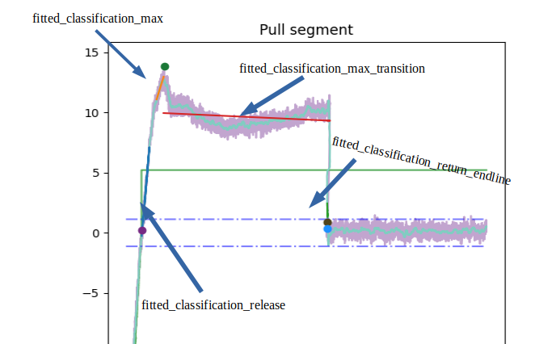
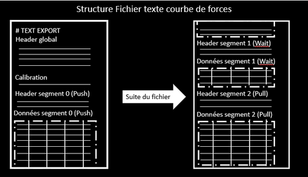

OT_Analysis
==========

# Tool for managing the results of optical tweezers
Tool for extracting, analyzing and classifying optical tweezer data curves

# Journal Open Source Software
For better visibility and recognition of the real significant contribution in the analysis of optical tweezers data,
the tool was published in the open source software journal at the following address

# Install MiniConda && Create conda environment
For the installation of the library please install conda and create a virtual environment to avoid library conflicts (conflict between Spyder and PyQt5 observed)

For OS is Linux or Mac
```
wget https://repo.anaconda.com/miniconda/Miniconda3-latest-Linux-x86_64.sh
chmod +x Miniconda3-latest-Linux-x86_64.sh
./Miniconda3-latest-Linux-x86_64.sh
conda create -n "newenv"
conda activate newenv
source .bashrc
conda activate newenv
conda install pip
```

Otherwise OS is Windows:
Download conda at this address depending on your system OS versions: https://docs.conda.io/en/latest/miniconda.html
Go to the conda prompt
```
conda create -n "newenv"
conda activate "newenv"
conda install pip
```

# Install package

After for all:
```
python -m pip install OT_Analysis
```

# Launch project
In a termnial, run (from anywhere):
```
otanalysis
```

You can also download the package on Github and create an already complete virtual environment to launch the software
```
git clone https://github.com/phpuech/OT-Analysis.git
cd OTAnalysis
conda env create -f environment.yml

python -m main

```

## Flow of the use process
Launch on an interface allowing to select the parameters for a file analysis in back-end

### Condition of the experience
- condition: Name of the antibody present on the beads during the experiment
- drug: name of the drug used for the analysis if present

### Fitting management
Selection of the curve files to be analyzed either by selecting a directory or with the multiple selection of files
- model: The model used to fit the "Press" curves (linear or sphere)
If selected sphere, appearance of the physical parameters menu for the calculation of the Young's modulus
- eta: Poisson's ratio
- bead rdius: diameter of the ball used during the experiment

### Management of curve anomalies
Curve management parameters Incomplete (no analysis possible) or misaligned (analysis but warning)
- pulling length min : minimum percentage of the length of the "Pull" segment to determine if the curve is rejected despite the presence of all the segments indicated in the header
- Fmax epsilon: percentage of max force on the major axis to determine misalignment of the curve on the minor axes

### Classification condition
- NAD if jump is < (PN): force condition to classify non-adhesive curves < pN
- AD if position is < (nm): distance condition to separate the membership from the tubes
- AD if slope is < (pts): condition number of points to separate the membership of the tubes
- Factor overcome noise (xSTD): Number of times the standard deviation for the calculation of the characteristic points
- Factor optical effect (xSTD): Number of times the standard deviation to correct the optical effect

Appearance of a method loading button after loading data to redo a past analysis.

## Menu after launching the analysis
Three possible options:
- Supervised: Allows you to switch to a new window with the display of curves and a supervisory menu
- Unsupervised: Allows you to retrieve the output file of the automatic analysis
- ...with graphs: Allows you to retrieve the output file of the automatic analysis completed with all the graphs

If we choose supervised:
## Graphic display window with supervision
Visualization of all curves as a function of time on the 3 axes and as a function of distance on the main_axis

### Supervision menu
- Close supervision Panel: Possibility to close this menu for a more important visualization of the curves
- Buttons to navigate between the curves. Can be operated with the left/right arrow keys
- Button to save the output file with an indication that the supervision is stopped at this curve (treat_supervised column)
- curve name
- button for zooming with characteristic point and fit on distance curves (Pull and Press segment only)
- if curve misaligned warning of misalignment axis with a possibility to change this status
- fit validation of the Press segment
- management of the optical correction with a post-analysis control
- fit validation of the Pull segment
- correction of the type of curve classification (type defined checked)
- Pagination to determine our position in the whole analysis. Possibility to move with the 'Enter' key and the number of the curve

### Changes in points and fits
In the supervision interface, you can modify the characteristic points and curve fits:
Go to the force vs distance curve
In the menu press Edit/Pick event
in the secondary window that appears choose what you want to modify and click on OK
then click on the graph:
- on the selected point
- on the two extreme points for the fit

### Summary plot
On the last curve, a yellow button appears at the bottom of the supervision table. This button displays a graphic summary window for the validation of the input data as well as the classification with respect to the thresholds.
A toggle button in the upper right corner allows to switch from piecharts to scatter plots


# Documentation

If adding functionality with docstring, update the documentation

## Update
```
make html
```

## Visualization documentation
Click on the Help button in the interface
or 
```
firefox https://phpuech.github.io/user_doc.html
```

## Explanation output file
output file in the form of a table of 48 columns on the number of curves of the analysis (1 curve per line)
columns
### Important data from the analysis for post-processing
- treat_supervised type=bool
    True if curve visualized otherwise False
- automatic_type type=str
    type determined by the automatic analysis
- type type=str
    type given to the curve with the supervisor menu. If there is no supervision then the same as the 'automatic_type' column.
- automatic_AL type=str
    "No" if the curve is misaligned according to the automatic threshold otherwise "Yes"
- AL: str
    Readjustment through supervision. If no supervision, then same as "automatic_AL"
- automatic_AL_axe type=list
    secondary axis affected by curve misalignment and its sign to know the direction of the misalignment with respect to the direction of the main axis
- optical_state type=str
    optical correction applied (No_correction, Auto_correction, Manual_correction)


### Data of the analysis parameters
- model type=str
    model for the fit on "Press" segment chosen by the user for the analysis
- Date type=str
    date of creation of the curve file
- Hour type=str
    time of creation of the curve file
- condition type=str
    condition applied to the analysis set (often antibodies on the bead)
- drug type=str
    drug put in the medium for analysis (can be used to add a second condition)
- tolerance type=float
    noise tolerance for the baseline (xstd)
- bead type=str
    number of the ball used for the curve
- cell type=str
    number of the cell used for the curve
- couple type=str
    couple ball number and cell number

### Theoretical data present in the headers of the files
- main_axis type=str
    main axis of the experiment and the direction of approach of the cell with respect to the ball:
        +X: the cell approaches from the right
        -X : the cell approaches from the left
        +Y : the cell comes from the top
        -Y : the cell comes from the bottom
- stiffness type=float
    value of the spring stiffness to correct the distance values
- theorical_contact_force (N) type=float
    theoretical contact force between the ball and the cell required by the user before starting the experiment
- theorical_distance_Press (m) type=float
    theoretical length of the "Press" segment
- theorical_speed_Press (m/s) type=float
    theoretical speed of the "Press" segment
- theorical_freq_Press (Hz) type=float
    theoretical frequency of the "Press" segment
- time_segment_pause_Wait1 (s) type=float
    pause time of the "Wait" segment (often 0s)
- theorical_distance_Pull (m) type=float
    theoretical length of the "Pull" segment
- theorical_speed_Pull (m/s) type=float
    theoretical speed of the "Pull" segment
- theorical_freq_Pull (Hz) type=float
    theoretical frequency of the "Pull" segment


### Data calculated during the analysis
- baseline_origin_press (N) type=float
    average of the first 1000 points of the "Press" segment on the data without correction
- baseline_corrected_press (pN) type=float
    average of the first 1000 points of the "Press" segment on the data corrected to bring the baseline centered on 0
- std_origin_press (N) type=float
    standard deviation of the first 1000 points to define the noise rate of the curve (on the data without correction)
- std_corrected_press (pN) type=float
    standard deviation of the first 1000 points to define the noise rate of the curve (on the data correction)
- slope (pN/nm) type=float
    calculation of the force slope for the "Press" segment
- error (pN/nm) type=float
    calculates the error of the force slope for the "Press" segment
- contact_point_index type=int
    index of the contact point between the ball and the cell on the "Press" segment
- contact_point_value  (pN) type=float
    force value of the contact point between the ball and the cell on the "Press" segment
- force_min_press_index type=int
    index of the minimum force of the "Press" segment
- force_min_press_value (pN) type=float
    value of the minimum force of the "Press" segment
- force_min_curve_index type=int
    index of the minimum force of the curve (sometimes confused with minimum Press)
- force_min_curve_value (pN) type=float
    value of the minimum force of the curve (sometimes confused with minimum Press)
- point_release_index type=int
    'index of the point where the cell loses contact with the ball (without taking \ into account the adhesive molecules or the membrane tubes).'
- point_release_value (pN) type=float
    value of the point where the cell loses contact with the ball (without taking \ into account the adhesive molecules or the membrane tubes).
- force_max_pull_index type=int
    index of the maximum force on a part of the "Pull" segment between the release \ point and the return to the baseline
- force_max_pull_value (pN) type=float
    value of the maximum force on a part of the "Pull" segment between the release \ point and the return to the baseline
- force_max_curve_index type=int
    index of the maximum force of the curve
- force_max_curve_value (pN) type=float
    value of the maximum force of the curve
- Pente (pN/nm) type=float
    coefficient of the contact loss slope between the ball and the cell due to the retraction effect of the cell with respect to the ball

### Data calculated if type of curves different from non-adhesive, infinite tube or rejected

- point_transition_index type=int
    index of the break point of the tube (called transition point)
- point_transition_value (pN) type=float
    value of the break point of the tube (called transition point)
- point_return_endline_index type=int
    index of the point where the curve returns to the baseline values
- point_return_endline_value type=float
    value of the point where the curve returns to the baseline values

**Jumps:**
- jump_force_start_pull (pN) type=float
    force jump between the release point and the maximum force of the curve in the case of an adhesion or a finished tube
- jump_force_end_pull (pN) type=float
    force jump between the maximum force of the curve and the point of return to the baseline
- jump_nb_points type=int
    number of points between the point of return to the baseline and the maximum strength of the curve
- jump_time_start_pull (s) type=float
    time between the release point and the maximum force of the curve
- jump_time_end_pull (s) type=float
    time between the maximum force of the curve and the point of return to the baseline
- jump_distance_start_pull (nm) type=float
    distance between the release point and the maximum force of the curve
- jump_distance_end_pull (nm) type=float
    distance between the maximum force of the curve and the point of return to the baseline

### Slope of fits for classification

- slope_fitted_classification_max type=float
     slope of the linear adjustment of 1/3 of the points between the release point and the max point removed at the index of the max point
- slope_fitted_classification_release type=float 
    slope of the linear adjustment of 1/3 of the points between the release point and the max point add to the index of the release point
- slope_fitted_classification_max_transition type=float 
    slope of the linear fit between the max point and the transition point
- slope_fitted_classification_return_endline type=float
    slope of the linear fit between the transition point and the baseline return point

### Boolean validation of the fits
- valid_fit_press type=bool
    validation of the fit on the "Press" segment. False by default because not validated

- valid_fit_pull type=bool
    validation of the fit on the "Pull" segment. False by default because not validated


## Add features
To add a feature, two options are possible: 
- During the automatic analysis 
- After analysis for post processing

### In analysis
We need to add a method to the curve object
then call it in the "analyzed_curve" method of the curve object
This method is called by the controller when the automatic analysis is launched

### In interface
If we want to call an external post processing script: 
 - we create a method in the controller that loops on the dict_curve (dictionnare of curved object)
 - we adapt our add script so that it includes the data of the object
 - We then create a widget in the interface that calls the method of the view's controller attribute
if we want to add a new feature after analysis but on the object *curve :
 - we add a method to curve
 - we create a widget that calls this method through the dict-curve of the controller

 ## Adapt input
 The input text file must have a global header, a calibration part, segment headers and data

 
 If your data do not have a force (xsignal1, ysignal1, zsignal1), time (seriesTime) and distance column:
- You will have to implement methods in the specific curve object of your data
- modify the start of the analysis in the controller in the "create_dict_curves" method
- adapt the supervision to the data to display


## Prospect
* Problem on some computers for the pick event of matplotlib

