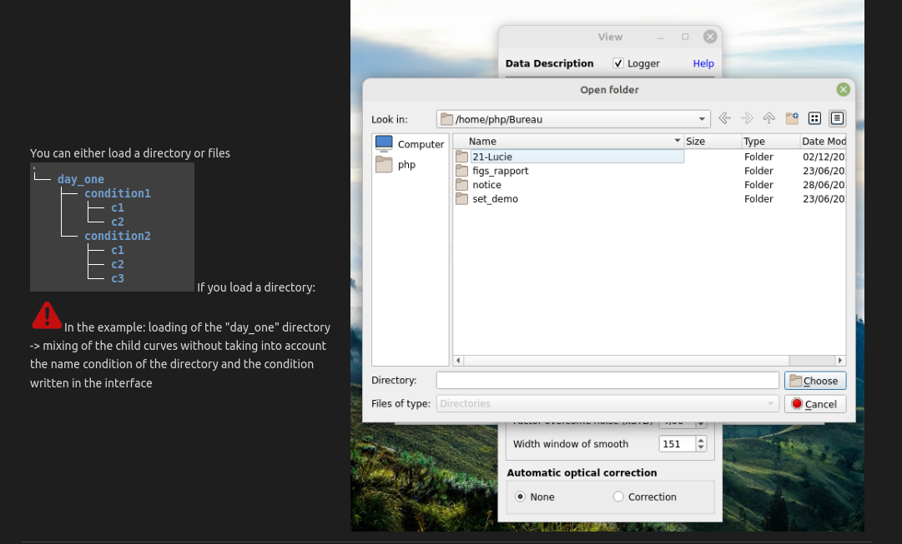
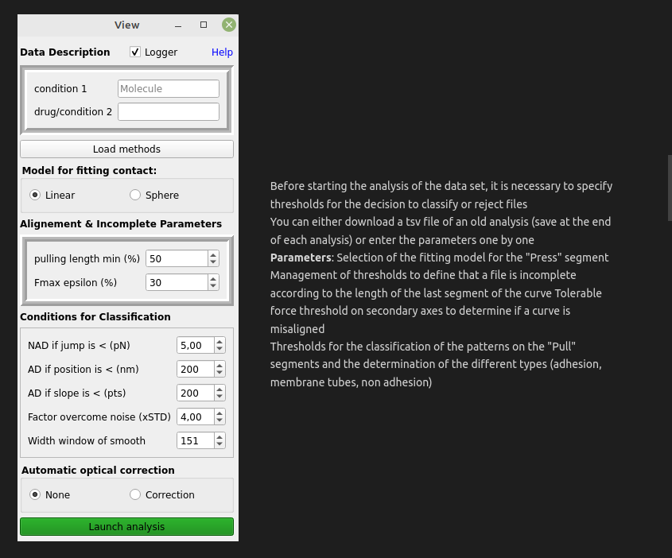
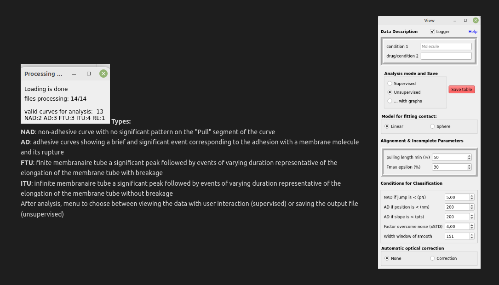
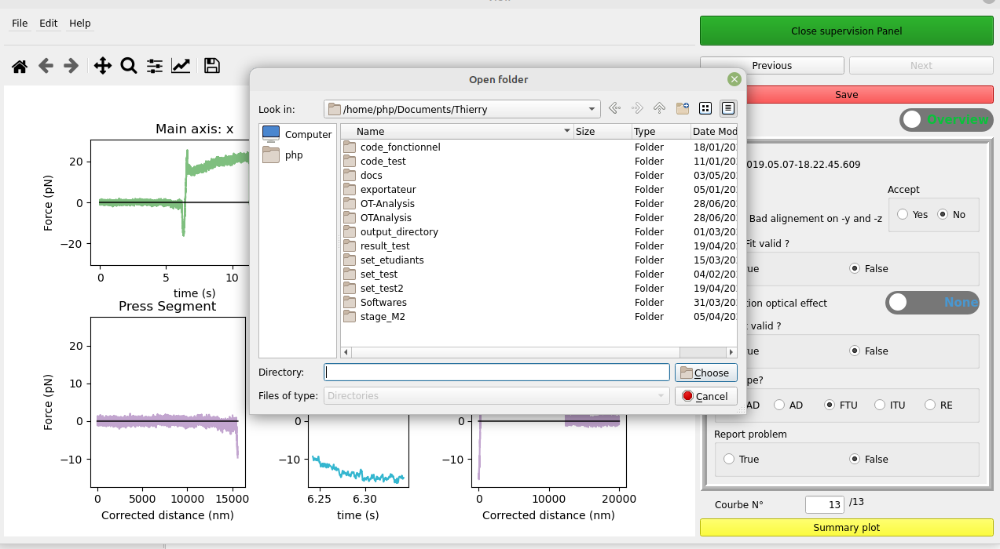

# <center> OT-Analysis: a software for rich analysis of force curves when probing living cells with optical tweezers </center>

<center>Thierry Galliano1, Guillaume Gay2,

Laurent Limozin1, Pierre-Henri Puech1</center>

1 : Inserm UMR 1067 / CNRS UMR 7333 / AMU UM61 / CENTURI ; Lab.Adhésion et Inflammation ; Marseille - France
2 : France Bio Imaging ; Montpellier – France

## Install MiniConda && Create conda environment
```
wget https://repo.anaconda.com/miniconda/Miniconda3-latest-Linux-x86_64.sh
chmod +x Miniconda3-latest-Linux-x86_64.sh
./Miniconda3-latest-Linux-x86_64.sh
```

## If OS system is Linux or Mac:
```
source .bashrc
```
Otherwise OS system Windows:<br>
Go to the application prompt conda or change the environment variable PATH

Then:
```
conda create -n newenv
conda activate newenv
```
## Install Package
```
conda install pip 
python -m pip install OT-Analysis
```
## Launch project
In a termnial, run (from anywhere):
```
otanalysis
```
## <center>Introduction</center>

Optical tweezers produce complex data that need to be sorted.
A classification software of the adhesion patterns allowing to categorize the curves and to retrieve the most important information for the recovery of significant results. The classification is done on the "Pull" segment according to 4 main types 
- NAD: non adhesion, 
- AD: adhesion, 
- FTU: finite membrane tube, 
- ITU: infinite membrane tube
thanks to detection thresholds. Two other types are possible
- INC for incomplete files 
- RE for rejected curves. 
The tool has additional features to correct the baseline of the optical effect or to modify some characteristic points of the classification.

Here are the details:

<br>
<br>
<br>
<br>

## Supervision

Visualization of the curves on the three space axes for the visualization of the alignment on the secondary axes.

Supervision panel to display and to modify the results of the analysis


Display of the force vs. time curve with characteristic points to determine the classification


Display of the force curve as a function of the plate displacement with characteristic points and allowing the determination of the classification

## Modification of the characteristic points or adjustments

If some points on the "Pull" segment are not correctly determined, you can directly select the coordinates of the points.


Possibility to select the transition fit, the transition point or the point of return to the baseline


## Correction of the optical effect

To correct the optical effect, please use the toggle in the supervision panel, this will open a secondary window


On the graph, by clicking, select the points of the extremities of the data range undergoing the optical effect


<p>Visualization of the correction with the orange curve compared to the blue curve representing the original data
To apply the correction to the original data, please press the "Accept correction" button on the top left </p>

## Summary plot

This graphical summary allows the user to verify the results.
Thanks to piechart, one can evaluate the quality of the results of the experiment
Thanks to the scatter plots, the good respect of the thresholds given to the analysis as well as the reliability of the classification


## Save output + method

After performing the analysis and making corrections  through supervision, we can save our results <br>
the name is output: output_{date}_{time}.csv <br>
the method namefile is: methods_date_time.tsv <br>

<br>

<br>

The output file is a csv file with 68 columns described in the software README.
* treat_supervised
* automatic_type
* type
* automatic_AL
* AL
* automatic_AL_axe
* optical_state
* model
* Date
* Hour
* condition
* drug
* tolerance
* bead
* cell
* couple
* main_axis
* stiffness (N/m)
* theorical_contact_force (N)
* theorical_distance_Press (m)
* theorical_speed_Press (m/s)
* thoerical_freq_Press (Hz)
* time_segment_pause_Wait1 (s)
* theorical_distance_Pull (m)
* theorical_speed_Pull (m/s)
* thoerical_freq_Pull (Hz)
* baseline_origin_press (N)
* baseline_corrected_press (pN)
* std_origin_press (N)
* std_corrected_press (pN)
* slope (pN/nm)
* error (pN/nm)
* contact_point_index
* contact_point_value (pN)
* force_min_press_index
* force_min_press_value (pN)
* force_min_curve_index
* force_min_curve_value (pN)
* time_min_curve_value (s)
* point_release_index
* point_release_value (pN)
* force_max_pull_index
* force_max_pull_value (pN)
* force_max_curve_index
* force_max_curve_value (pN)
* transition_point_index
* transition_point_value (pN)
* point_return_endline_index
* point_return_endline_value (pN)
* Pente (pN/nm)
* jump_force_start_pull (pN)
* jump_force_end_pull (pN)
* jump_nb_points_start
* jump_nb_points-end
* jump_time_start_pull (s)
* jump_time_end_pull (s)
* jump_distance_start_pull (nm)
* slope_fitted_classification_max (pN/nm)
* slope_fitted_classification_release (pN/nm)
* slope_fitted_classification_max_transition (pN/nm)
* slope_fitted_classification_return_endline (pN/nm)
* jump_distance_end_pull (nm)
* relative_path
* valid_fit_press
* valid_fit_pull


